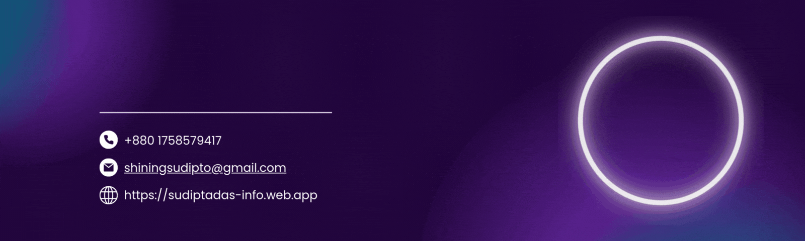

<!-- Name -->

<h1 align="center">Hey, I'm Sudipta Das</h1>
<!-- Position -->
<h2 align="center">Web Developer</h2>
<!-- Additionals -->

- 👋 Hello there! I'm Sudipta Das, a passionate junior MERN stack developer with a strong love for coding and a thirst for continuous learning. My journey into the world of web development has been exhilarating, and I'm always eager to take on new challenges and broaden my horizons.

- 🌱 I’m focusing on **MERN Stack** 🔥

- 🤝 I firmly believe in the power of collaboration and teamwork. I am open to collaborating with like-minded individuals on exciting projects that can make a positive impact on the world. I believe that the best solutions are born when talented minds come together to brainstorm and create.

- 📚 As a lifelong learner, I am constantly seeking opportunities to enhance my skills and knowledge. Staying updated with the latest trends and best practices is essential to deliver top-notch solutions.

- 📫 How to reach me **shiningsudipto@gmail.com**

- ⚡ Fun fact **"Problem solving is another way to loose your depression"**

### **Key Technologies I Work With:**

- **Frontend:** React.js, Next.js, TypeScript, TailwindCSS, Bootstrap
- **Backend:** Node.js, Express.js, Prisma, JWT, Mongoose
- **Databases:** PostgreSQL, MongoDB
- **Other:** Redux Toolkit, RTK Query, Zod, AmarPay, Strip

### **🔥 Some of myProjects:**

1. ✔️ [**Electro Hub**(an e-commerce site)](https://electro-hub-bd.netlify.app)

   > **Technology Used:** React JS, Redux, TailwindCSS, Material tailwind, Express JS, Prisma, PostgreSQL, JWT, Amarpay

   - github: [Frontend repository](https://github.com/shiningsudipto/a9-client) | [Backend repository](https://github.com/shiningsudipto/a9-server)

2. ✔️ [**Ultimate Tripz**(a social media site)](https://ultimate-tripz.netlify.app)
   > **Technology Used:** Next JS, Shadcn, Redux, Express JS, MongoDB, JWT, Amarpay
   - github: [Frontend repository](https://github.com/shiningsudipto/ultimate-tripz-frontend) | [Backend repository](https://github.com/shiningsudipto/ultimate-tripz-backend)
3. ✔️ [**MEGAPIXEL**(an online school)](https://megapixel-78f33.web.app)
   > **Technology Used:** React JS, Node JS, Express JS, MongoDB, JWT, Firebase, Stripe
   - github: [Frontend repository](https://github.com/shiningsudipto/Megapixel-Client-Side) | [Backend repository](https://github.com/shiningsudipto/Megapixel-Server-Side)

### 📋 **Company Projects:**

1. ✔️ [**JAYGA**(a Warehouse Management System)](https://jayga.io/)

### 📋 **Freelance Projects:**

1. ✔️ [**BHOJJO**(a Retailer e-commerce shop)](https://bhojjo.com)

### 💼 **Work Experience:**

- React Developer at [Kodezen](https://www.linkedin.com/company/kodezenteam/mycompany/) ( 15th November 2023 - Feb 2024 )
- Frontend Developer at [Jayga](https://www.linkedin.com/company/jayga/) ( joined 1 Mar 2024 )
- Frontend Developer at [DesklaGo](https://www.linkedin.com/company/desklago) ( joined 1 May 2025 )

<h3 align="left">Connect with me:</h3>

 
<h3 align="left">Languages and Tools:</h3>

 

<!-- JavaScript -->

 

<h3 align="left">Familiar with:</h3>

---

### Trophy

